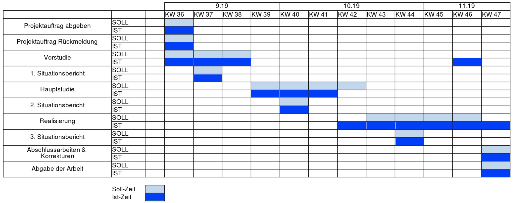

= Projektantrag VA
Niklas Liechti <nliechti@nliechti.ch>
:doctype: pdf
:author: Niklas Liechti
:subtitle: Kubernetes Clusterservice
:ntitle: {subtitle}
:class: ITSE 17a
:pdf-stylesdir: /Users/nliechti/bin/ives_theme/resources/themes
:pdf-fontsdir: /Users/nliechti/bin/ives_theme/resources/fonts
:pdf-style: tbz
:allow-uri-read:
:sectnums:
:toc:
:toc-title: Inhaltsverzeichnis
:title-page:

<<<

== Einleitung

Die Vertiefungsarbeit soll das bereits gelernte im Lehrgang vertiefen.
Dazu kommen bei meiner Arbeit noch Themen des Vertiefungsfaches Betriebssystem-Technik (V-BT).
Bisher hatte ich mit meinem gewählten Thema (Clusterservices mit Kubernetes) nur sehr kleine Berührungspunkte.

Docker hingegen kenne ich schon eine Weile und habe im Geschäft auch immer wieder Berührungspunkte.

Natürlich möchte ich bei dieser Arbeit hauptsächlich Kubernetes besser kennen lernen.
Bei Gelegenheit werde ich vielleicht auch noch die Azure Pipelines anschauen, die seit der Übername
von Microsoft scheinbar recht gut in Github integriert wurden.

== Kontaktangaben

*Adresse* +
Niklas Liechti +
Meienbergstrasse 5 +
8645 Jona

*Email* +
nliechti@nliechti.ch

*Telefon* +
Mobile: +41 77 432 64 45

== Antrag

=== Projektauftrag

Die Vorgabe für das Projekt ist das entwickeln eines Usecases für einen Clusterservice auf Kubernetes basierend.
Nach dem Initialen Gespräch wurde die Aufgabenstellung sehr konkretisiert. +
Es soll nun um ein kleines Management System für die Kubernetes Cluster des TBZ werden.

Die Platform ist ausdrücklich nur für Lehrer, um die neu angeschafften Kubernetes Cluster für den Unterricht nutzen zu können.
Es soll einfach eine mehrzahl von Services zu übungszwecken deployt werden können.

=== Ausgangsaleg / Bisherige Erfahrung

Beruflich hatte ich bereits einen sehr kleinen Berührungspunkt mit Kubernetes, genauer mit der GKE (Google Kubernetes Engine) in der GCP (Google Cloud Platform).
Dieser ausflug war aber nur ein sehr beschränkter POC auf 3-4 Tage.

Da ich Software Engineer bin habe ich auch das nötige wissen und können um diese Applikation zu bauen.

== Anforderungen

=== Setup lokale Kubernetes Umgebung

Um überhaupt mit der Arbeit starten zu können muss zuerst eine lokale Kubernetes Umgebung aufgesetzt werden, was ich noch nie gemacht habe. 

*Aufwand*

*Klein*: Der Aufwand sollte sich hier im Rahmen halten, da ich nicht der erste bin der so etwas machen möchte.

=== Konzeption Applikation / Aufteilen in Tickets

Die grobe Architektur 

.Architektur
[#img-architektur]
image::architektur.png[Architektur]

*Aufwand*
*Mittel*: Einen sinnvollen Usecase zu finden der nicht zu simple sind, kann einige Zeit in anspruch nehmen.
 
=== Deploy Demoservice auf TBZ Kubernetes und lokal

Nach dem Konzipieren eines möglichst sinnvollen Demoservices muss dieser noch sinnvoll zusammengesteckt werden. 

*Aufwand*

*Gross*: Dies sollte der grösste Teil der Arbeit sein, da es doch viel Feinarbeit braucht, bis alles reibungslos läuft.

=== Messungen / Vorführung

Um den Usecase vorführen zu können, wäre ein kleines Script sehr hilfreich, welches die Vorteile des Deployments direkt aufzeigen kann.

Z.B sobald last auf das System kommt, scaled es hoch um alle Anfragen bearbeiten zu können.

*Aufwand*

*Klein - Mittel*: Um den Effekt sinnvoll vorzuführen, braucht es ein kleines Tooling, welches gebaut werden muss. 

<<<

== Ziele

=== Muss Ziele

. Die Applikation muss auf der Kubernetes Infrastruktur des TBZ laufen
. Die Applikation muss auf einer Lokalen Installation laufen
. Die Applikation muss per WebUI bedienbar sein
. Services
.. Es soll ein Service von Helm deploybar sein
.. Die Anzahl Replikation muss einstellbar sein
.. Die Daten müssen auf dem Cluster persistiert werden können 

=== Kann Ziele
* Es soll die möglichkein der Visualisierung der Services angeschaut werden.

== Tools

* Git / Github (https://github.com/nliechti/tbz_hf_va)
* Asciidoc für Projektdokumentation
* Markdown für Softwaredokumentation
* Docker
* Kubernetes (1.14.1)

== Milestones

[frame="topbot", cols="2", grid="rows"]
|===
h| Milestone h| Datum
| Projektantrag | 06.09.2019
| Projektauftrag | 11.09.2019
| Situationsbericht 1 | 13.09.2019
| Situationsbericht 2 | 04.10.2019
| Situationsbericht 3 | 01.11.2019
| Abgabe Arbeit | 22.11.2019

|===

<<<

=== Zeitplan

.Zeitplan
[#img-zeitplan]

== Bescheinigung
Hiermit bescheinigung Auftraggeber und Auftragnehmer seite, dass die VA den anforderungen Entspricht und in diesem Rahmen durgeführt werden kann.

[frame="none", grid="none", cols="2"]
|===
a| Auftraggeber +
Marcel Bernet +
 +
 +
_{zwsp}_{zwsp}_{zwsp}_{zwsp}_{zwsp}_{zwsp}_{zwsp}_{zwsp}_{zwsp}_{zwsp}_{zwsp}_{zwsp}_{zwsp}_{zwsp}_{zwsp}_{zwsp}_{zwsp}_{zwsp}_{zwsp}_{zwsp}_{zwsp}_{zwsp}_{zwsp}_{zwsp}_{zwsp}_{zwsp}_{zwsp}_{zwsp}_{zwsp}_{zwsp}_{zwsp}_{zwsp}_{zwsp}_{zwsp}_{zwsp}_{zwsp}_{zwsp}_{zwsp}_{zwsp}_{zwsp}
| Auftragnehmer / Projektleiter +
Niklas Liechti +
 +
 +
_{zwsp}_{zwsp}_{zwsp}_{zwsp}_{zwsp}_{zwsp}_{zwsp}_{zwsp}_{zwsp}_{zwsp}_{zwsp}_{zwsp}_{zwsp}_{zwsp}_{zwsp}_{zwsp}_{zwsp}_{zwsp}_{zwsp}_{zwsp}_{zwsp}_{zwsp}_{zwsp}_{zwsp}_{zwsp}_{zwsp}_{zwsp}_{zwsp}_{zwsp}_{zwsp}_{zwsp}_{zwsp}_{zwsp}_{zwsp}_{zwsp}_{zwsp}_{zwsp}_{zwsp}_{zwsp}_{zwsp}
|===