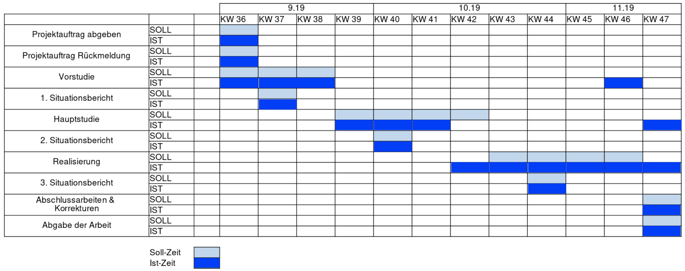

== Controlling

=== Zeitplan

Grundsätzlich konnte der Zeitplan relativ gut eingehalten werden. Aufgrund von feedback vom Auftraggeber habe ich die Vorstudie und Hauptstudie immer wieder leicht angepasst.

Die Dokumentation wurde im ininitalen Zeitplan nicht wirklich berücksichtigt, erfolgete aber währen der gesammten umsetzungszeit fortlaufend.

=== Ticket Tracking

Ich habe bei dem Projekt auch versucht mit github https://github.com/nliechti/tbz_hf_va/projects[tickets] den Fortschritt des Projektes zu Tracken.

Dies hat in diesem Projekt mit sehr beschränkten Zeit mitteln nur bedingt funktioniert. Es war aber grundsätzlich nicht schlecht als Motivation, zu sehen was ich doch bereits alles gemacht habe. Vor allem im Infrastrukturellen bereich am anfang ist es schwierig den Überblick über den Fortschritt zu halten.

Auch konnte diese Variante nicht 100% ausgespielt werden, da ich komplett alleine an dem Projekt ge arbeitet habe.

<<<

=== Applikationstest

.Testfälle
|===
| Testfall | Test Konfiguration | Ausgang

| Mails verschicken
| Gmail smtp mit privatem account verwendet.
| Funktioniert mit der über die ENV mitgegebene config für einen SMTP Server

| CSV Von klasse hochladen
| Testfile mit anonymisierten daten getestet. Direkt von ecolm.com
| Verschickt Mail einwandfrei

| Deployment auf Kubernetes
| Deployt auf einem Minikube lokal
| Deployment funktioniert mit den Zugangsdaten über ENV gesetzt

| Deployment von DB Jupyter Modul 
| https://github.com/zoink1989/vertiefungsarbeit/blob/master/dbCluster.yml[Repo] auf cluster Deployt
| Deployment funktioniert und zugriff ist möglich
|===