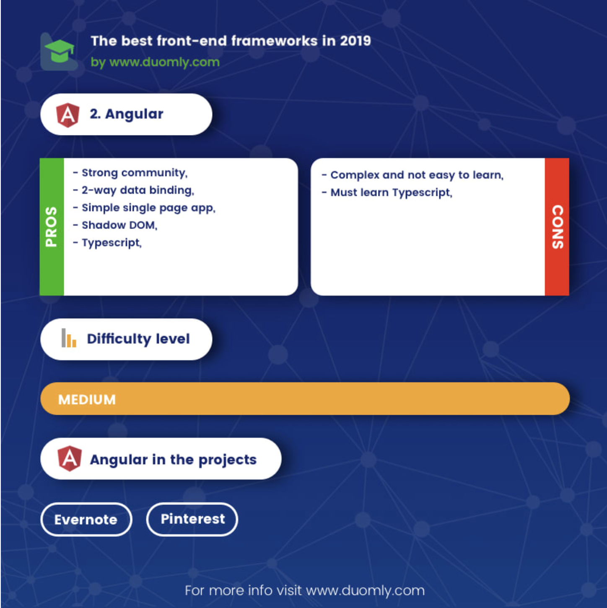
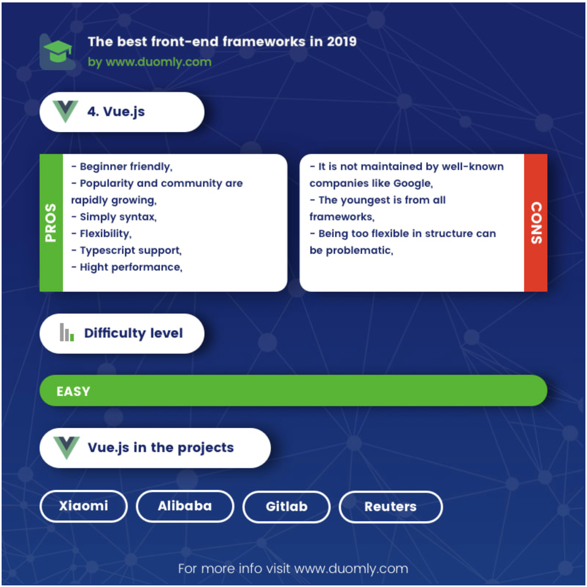
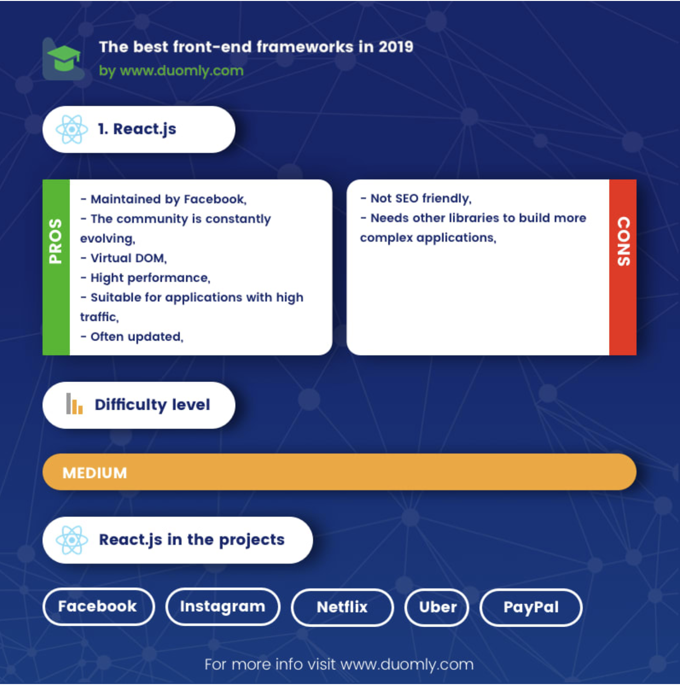

== Technologien

=== Frontend

Aktuell ist das Frontend immer noch massiv von Javascrip dominiert. Langsam kommen Konkurenten wie https://webassembly.org/[Web Assembly] hervor. Diese sind aber noch viel zu Jung und zu wenig verbreitet um momentan für eine Applikation ein zu setzten.

Daher habe ich mich dazu entschieden noch mit einem Javascript Framework weiter zu machen.

Frontend Javascript Frameworks sind seit Jahren im starken Wandel.

==== Framework

Im Frontend bereich habe ich von den "modernen" Frameworks nur Erfahrung in Angular.js, welches aber schon seit einigen Jahre eigentlich überholt ist.

Daher habe ich mich bei der Entscheidung an einen Blogpost von https://dev.to/duomly/the-best-front-end-framework-to-learn-in-2019-dn7[dev.to] und Erfahrung von Arbeitskollegen angelehnt.

<<<

===== Angular 2+

Angular ist das nachfolge Framework von angular.js, welches weiterhin von Google maintained wird.

Mit Angular habe ich minimale Erfahrung durch einen 1 Monatigen einsatz in einem kleineren Projekt.

Wie unten ersichtlich ist das Lernen und aufsetzen eines Angular Projektes relativ komplex. Grundsätzlich ist es extrem gut einsetzbar für grössere Singlepage apps.
Die vorgegebene Struktur ist ein grosser Vorteil für Projekte mit vielen Personen, was in diesem Projekt aber nicht relevant ist.

.Angular
[link=https://angular.io/]

<<<

===== Vue.js

Vue.js ist das neuste aller Frameworks. Es ist sehr einfach zu lernen und grundsätzlich sehr leichtgewichtig.
Es ist ähnlich reaktiv wie react.js und nutzt Web components excessiv.

.Vue.js
[link=https://vuejs.org/]

<<<

===== React.js

React.js ist eine möglichst schlank gehaltene Frontend Library, welche von Facebook maintained wird. Das Konzept ist wie der Name schon sagt reaktives verhalten. Das heisst man beschreibt grundsätzlich welche Daten dargestellt werden sollen und das Framework kümmert sich dann um das "reagieren" auf changes des stetes.

.React.js
[link=https://reactjs.org/]

<<<

==== Entscheidung

Das am einfachsten auf zu setzende Framework ist in meinem Fall Vue, da es direkt von meinem Backend Framework unterstützt wird. Da sich alle Frameworks für meinen Anwendungsfall nicht viel nehmen, habe ich mich für Vue.js entschieden.

=== Backend

Das Backend ist grundsätzlich seit jeher stabiler, da diese Platform meist voll unter Kontrolle des betreibenden liegt. Diese wahl wurde in den Letzten Jahren aber auch immer flexibler, da mit Docker fast jede beliebige Betriebssystem Umgebung gebaut werden kann.

Die meiste Erfahrung habe ich selber mit Java EE Applikationne, welche aber hier ein zu grosses Kaliber wären.

Zusätzlich habe ich in letzter Zeit viel Positives über https://kotlinlang.org/[Kotlin] gehört.
Kotlin ist eine auf der Jvm basierte Sprache, die nahe an Java ist, aber sehr viel Syntactic Sugare anbietet und das Entwickeln von genau solchen kleinen Applikationen extrem einfach macht.

==== Framework

Als Framework habe ich mir nach kurzem recherchieren und nach Feedback von Arbeitskollegen https://javalin.io/[Javalin] ausgesucht. 

Javalin ist ein leichtgewichtiges Microservice Framework, welches mit nativ Kotlin unterstützung kommt.

Auch bietet Javalin integrierter Support für Vue.js komponenten, was natütlich ein sehr praktischen Vorteil ist.

=== Database

Um Datenbank migrationen für so ein kleines Projket zu Vermeiden setzte ich auf ein NosqlDB.

Nach kurzer suche bin ich auf https://github.com/dizitart/nitrite-database)[Nitrite] gestossen

=== Deployment

Da das Deployment der Applikation auf einem Standart TBZ Cluster laufen muss, war das Deployment als Docker Image fix.

=== Buildsystem

Als Buildsystem für das Projekt habe ich https://gradle.org/[Gradle] mit der Kotlin DSL eingesetzt. Dieses Buildsystem ist sein einigen Jahren Standard im Java Universum.
Mit gradle builde ich ein FatJar mit dem ShadowJar plugin, welches dann in ein Docker Image verpackt wird.

==== Dependencies

Gradle macht auch das Dependencie management. Die dependencies sind https://github.com/nliechti/tbz_hf_va/blob/a8f5c3fceeaf981fbf61f2db3cf2f3466ec9cabe/app/build.gradle.kts#L52[hier] zu sehen.

=== CI / CD

Da bei einer so komplexen Umgebung ein Continous integration nur mit viel Aufwand möglich ist, gibt es dies hier nicht.

Für den Continous delivery Teil sorgt https://travis-ci.com/[Travis], welcher bei jedem Push auf das Repo ein latest Docker image baut und dieses zu Dockerhub pusht.
Sobald ein Commit ge tagt ist, wird zusätzlich ein fixe Version released.