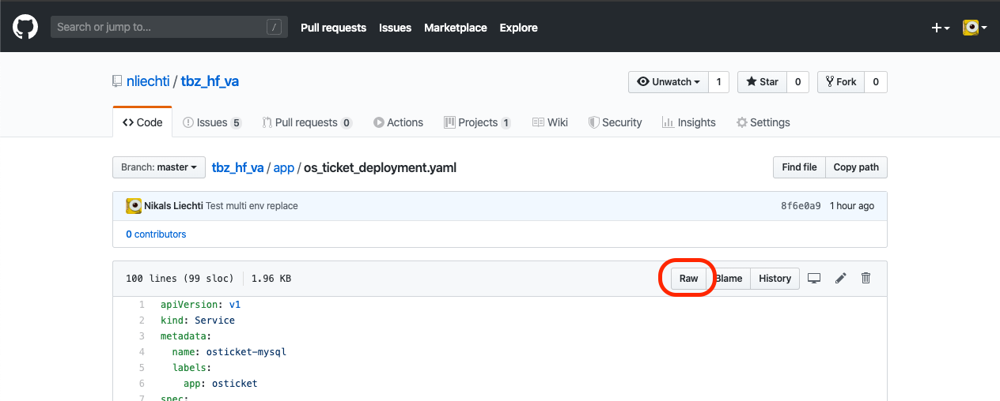

# How to create a resource for TBZ Deployer

## Hosting

Momentan wird nur Github als host der Kubernetes yaml files unterstützt.

### Wichtige zu beachten

* Der ganze service muss in einem File sein.
* Die Services müssen im Yaml File mit `---` voneinader getrennt sein [Yaml Spec](https://yaml.org/spec/1.2/spec.html#id2760395)
* Der link zum file muss das "Rohe file" beinhalten:  



WICHTIG: Es kann einige Minuten dauern, bis das Raw file von github aktualisiert wird.

## Varible Replacement

Damit nicht alle Schüler das gleiche Passwort bei der Applikation haben, können "markierte" Env variablen durch einen random 20 Zeichen langen String ersetzt werden.

Damit eine Variabel ersetzt wird, muss einfach bei dem Service eine Annotation gesetzt werden, welches mit `tbz-replace-env` beginnt. Danach wird es automatisch vom TBZ Deployer ersetzt.

Dieser mechanismus wurde so gebaut, damit das file ohne den deployer mit einem sinnvollen Passwort deployt werden kann.

```
metadata:
  name: osticket
  annotations:
    tbz-replace-env: ADMIN_PASSWORD
    tbz-replace-env-1: BLA_TEST_VALUE 
spec:
  replicas: 1
  selector:
    matchLabels:
      app: osticket
  template:
    spec:
      containers:
        - name: osticket
          image: campbellsoftwaresolutions/osticket
          env:
            - name: ADMIN_PASSWORD
              value: adminPw
            - name: BLA_TEST_VALUE
              value: toReplace
```

## Services

Um von aussen auf den Cluster zugreiffen zu können, muss ein LoadBalancer service vorhanden sein.
Dieser ist meist zusätzlich zu einem internen Service nötig. Dieser ist nur für die Cluster interne kommunikation zuständig.

## Example

Vollständige Examples sind hier zu finden:

* [OS Ticket](https://raw.githubusercontent.com/nliechti/tbz_hf_va/master/app/os_ticket_deployment.yaml)
* [DB Modul](https://github.com/zoink1989/vertiefungsarbeit/blob/master/dbCluster.yml)
