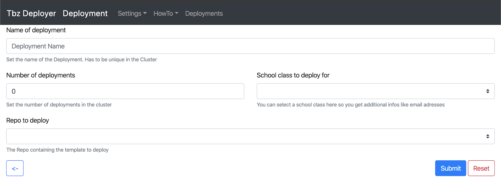

# TBZ Deployer

## Deployments

## Repos

Repos sind Grundsätzlich applikationen, welche deployt werden können. Diese müssen nach dieser [Anletung](HowToResource.md) erstellt werden.

## Klassen
Die Klassen können unter "Settings / Klassen" hochgeladen werden. Hier kann das CSV hochgeladen werden, welches alle Schüler mit emails beinhaltet. Dieses kann von [ecolm.com](ecolm.com) herunter geladen werden.
⚠️ Nur dieses File funktionier