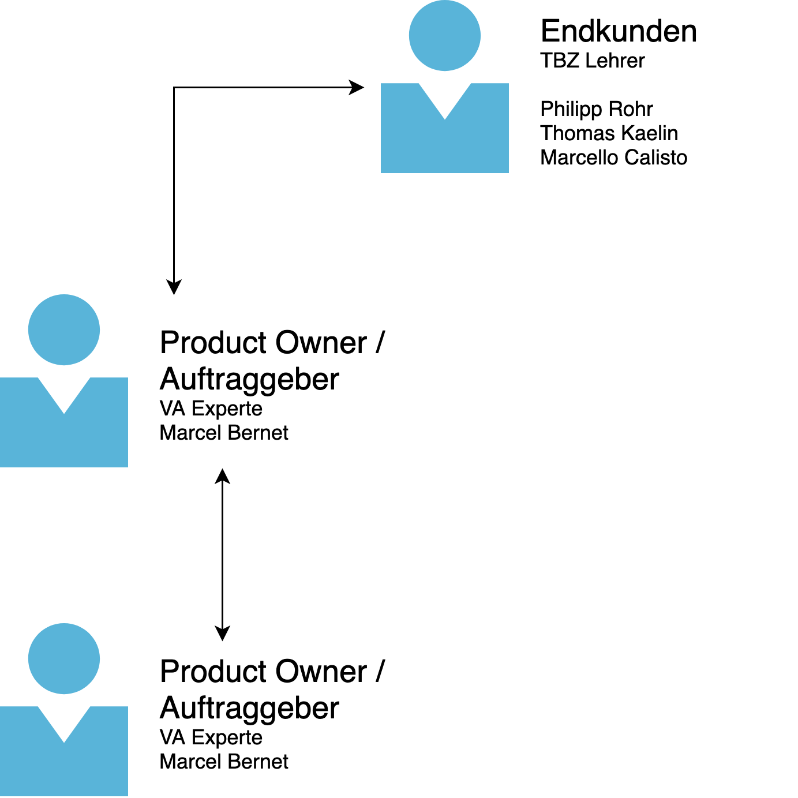

== Antrag
=== Organigramm

Da das Projekt recht klein ist, hält sich auch das Organigramm in Grenzen. Grundsätzlich sind es 5 Beteiligte. Im Kern sind aber nur 3 Personen enger Involviert. 

* Marcel Bernet (Auftraggeber)
* Niklas Liechti (Projektleitung / Umsetzung)
* Thomas Kälin (Berufsschullehrer)

=== Projektauftrag

Die Vorgabe für das Projekt ist das entwickeln eines Usecases für einen Clusterservice auf Kubernetes basierend.
Nach dem Initialen Gespräch wurde die Aufgabenstellung sehr konkretisiert. +
Es soll nun um ein kleines Management System für die Kubernetes Cluster des TBZ werden.

Die Platform ist ausdrücklich nur für Lehrer, um die neu angeschafften Kubernetes Cluster für den Unterricht nutzen zu können.
Es soll einfach eine mehrzahl von Services zu übungszwecken deployt werden können.

=== Ausgangsaleg / Bisherige Erfahrung

Beruflich hatte ich bereits einen sehr kleinen Berührungspunkt mit Kubernetes, genauer mit der GKE (Google Kubernetes Engine) in der GCP (Google Cloud Platform).
Dieser ausflug war aber nur ein sehr beschränkter POC auf 3-4 Tage.

Da ich Software Engineer bin habe ich auch das nötige wissen und können um diese Applikation zu bauen.

=== Budget

Grundsätzlich steht für die Umsetzung der Vertiefungsarbeit kein Budget zu verfügung. 
Lediglich ein Zeitbudget von ca. 100 Arbeitsstunden ist vorgesehen.
