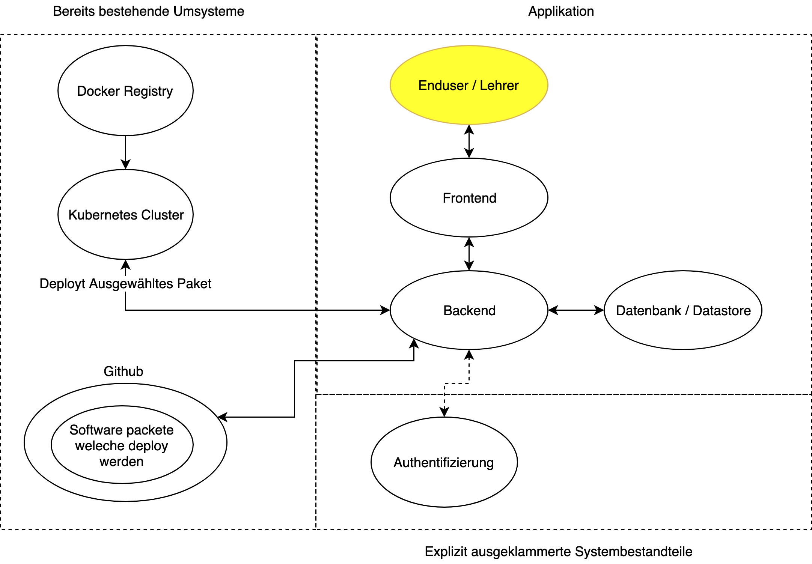

== Systemdefinition / Abgrenzungen

=== Systemgrenzen

==== Umsysteme

===== Kubernetes Cluster

Der Kubernets cluster wird zum Deployment der Applikationen verwendet. Da der Hauptteil der Applition die Kommunikation mit der Kubernetes Cluster ist hat er die Wichtigste Schnittstelle zum Projekt.

===== Github

Github wird zum "hosten" der Kubernetes Config files verwendet. 

Bedeutet: Die Konfiguration der zu deployenden Services muss in einem yaml File auf Github gepusht werden, damit der Deployer diese Konfiguration dann von dort wieder einlesen kann.

===== Docker Registry / Dockerhub

Eine Dockerregistry, im Normalfall das von Docker bereitgestellte Dockerhub beherberrgt die Dockerimages der Services.
Daher die eingentliche Software die danach auf den Kubernetes Cluster deployt wird.

=== Applikation

Die Applikation selber besteht aus Vier Untersystemen.

==== Enduser

Der Enduser ist in diesem Fall in fast allen Fällen ein Lehrer. Dieser will für seine Schüler mit hilfe der noch zu erstellenden Applikation eine Umgebung bereit stellen.

==== Frontend

Über das Frontend interagiert der Enduser indirekt mit dem Cluster. Idealerweise muss er nie ein Tool, wie z.B. `kubectl` benutzen. 

Das Frontend soll so einfach wie möglich zu bedienen sein, damit kein konfigurationsfehler gemacht werden können.

==== Backend

Das Backend interagiert mit dem Kubernetes Cluster. Es nimmt die gegebenen Konfigurationen und appliziert diese auf den Cluster.

==== Datastore

Der Datastore hält möglichst wenige Informationen, da dies in dieser Applikation eigentlich kaum nötig sein sollte. Dennoch müssen z.B. die Hinterlegten Repos irgendwo abgespeichert werden.

==== Authentifizierung (Abgegrenzt)

Die Authentifizierung gegenüber der Applikation ist explizit abgegrenzt und wird in dieser Arbeit nicht umgesetzt.